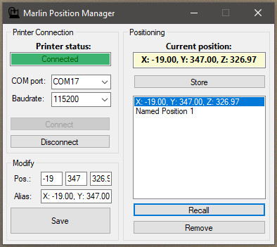
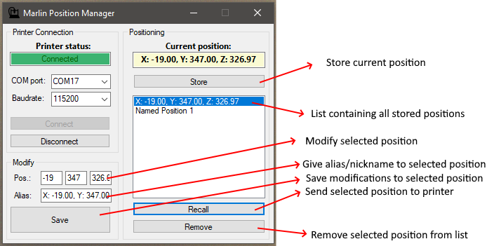

# Marlin Position Manager
I’d like to share a tool I’ve made and been using for some time now; I called it “Marlin Position Manager”. In short, it allows you to store and recall printer positions. As the name implies, it’s compatible with Marlin printers. The tool connects to your Marlin printer over USB (serial connection).

Explanation of buttons on the UI:

The positions that are stored are persisted (saved in an XML file in the folder where the .exe resides).
